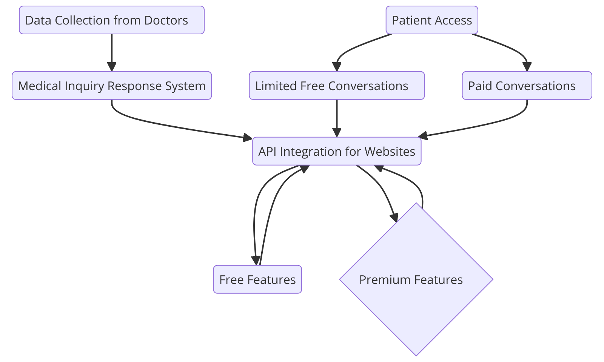

# Link: https://ai-powered-healthcare-chatbot.onrender.com

# AI-Powered Healthcare Chatbot

An advanced AI-driven healthcare chatbot designed to offer real-time medical assistance, powered by the LLaMA model. This project uses Python Flask for the backend, SQLite3 for database management, and HTML, CSS, and JavaScript for the frontend. The chatbot supports multiple languages, stores conversation histories, and maintains separate sessions for each user.

## Business Idea

Our healthcare chatbot platform is built to assist healthcare professionals by providing a basic chatbot service with free and premium tiers. The business model includes:

- **Data Collection and Chatbot Creation**: We gather datasets from medical experts and create a basic, free-to-use chatbot tailored to their field.
- **Free and Premium Features**:
  - **Free Plan**: Offers essential chatbot functionality to address patient queries.
  - **Premium Features**: Doctors can upgrade to premium features, such as multi-language support, multimedia support, and extended capabilities to provide a more comprehensive digital interaction.
- **Patient Billing and Platform Fees**:
  - **Limited Free Queries**: Patients can initially ask a certain number of queries for free.
  - **Pay-As-You-Go Model**: After the free limit, patients pay a nominal fee per query, billed monthly at a significantly lower rate than traditional doctor consultation fees.
  - **Platform Fee**: A platform fee is charged for patients to use this AI-driven interaction, offering them professional medical advice at an affordable rate.

This approach offers value to healthcare providers by automating routine inquiries and provides patients with easy access to expert advice in a budget-friendly model.

## Business Architecture



> **Project Architecture Explanation**: The chatbot application follows a structured approach:
> - **Frontend**: User interactions are handled through a responsive UI.
> - **Backend (Flask)**: Manages routing, authentication, data processing, chat history, and user sessions.
> - **Database (SQLite3)**: Stores user data and chat histories.
> - **AI Model (LLaMA via LM Studio)**: Processes user queries and provides responses.
> - **Ngrok**: Exposes the local server to the web, enabling remote access.

## Features

- **AI-Powered Responses**: Intelligent responses to healthcare queries.
- **Multi-Language Support** (Premium): For seamless interactions in multiple languages.
- **Session Management**: Unique sessions for privacy.
- **Conversation History**: Stores chat histories for context.
- **Secure User Authentication**: Login, registration, and logout.
- **Responsive Frontend**: Modern, user-friendly interface.

## Project Structure

```plaintext
/healthcare-chatbot
│
├── app.py                # Flask application and backend logic
├── /templates/           # HTML templates for the frontend
│   └── index.html
├── /static/              # Static files (CSS, JS)
│   ├── styles.css        # Styling for the chatbot interface
│   └── scripts.js        # JavaScript for frontend interaction
├── chatbot.db            # SQLite3 database for user and chat history
└── requirements.txt      # Dependencies for the project
```

## Setup

### 1. Clone the Repository

```bash
git clone https://github.com/your-username/healthcare-chatbot.git
cd healthcare-chatbot
```

### 2. Install Dependencies

```bash
python -m venv venv
source venv/bin/activate  # On Windows, use `venv\Scripts\activate`
pip install -r requirements.txt
```

### 3. Set Up the Database

```bash
python
from app import init_db
init_db()
exit()
```

### 4. Set Up LM Studio

1. Download LM Studio from [here](https://www.lmstudio.com/).
2. Load the LLaMA model in LM Studio and configure it for inference.
3. Use Ngrok to make the model accessible:

```bash
ngrok http 5000
```

### 5. Run the Application

```bash
python app.py
```

## API Endpoints

- **`/login`** - User login with credentials.
- **`/register`** - Register a new user.
- **`/chat`** - Send a message and receive an AI response.
- **`/new_chat`** - Start a new conversation.
- **`/get_chat_history`** - Retrieve chat history.
- **`/logout`** - Log out the user.

## Technologies Used

- **Python & Flask**: Backend API and processing.
- **SQLite3**: Stores user data and chat histories.
- **LLaMA Model**: AI model for generating responses.
- **Ngrok**: Makes the local model server public.
- **Frontend**: HTML, CSS, JavaScript for UI.

## Contributing

Contributions are welcome! Fork, create a branch, and open a pull request.

## License

This project is licensed under the MIT License.

## Contact

For inquiries, reach out to [akshaykarthick486@gmail.com].
